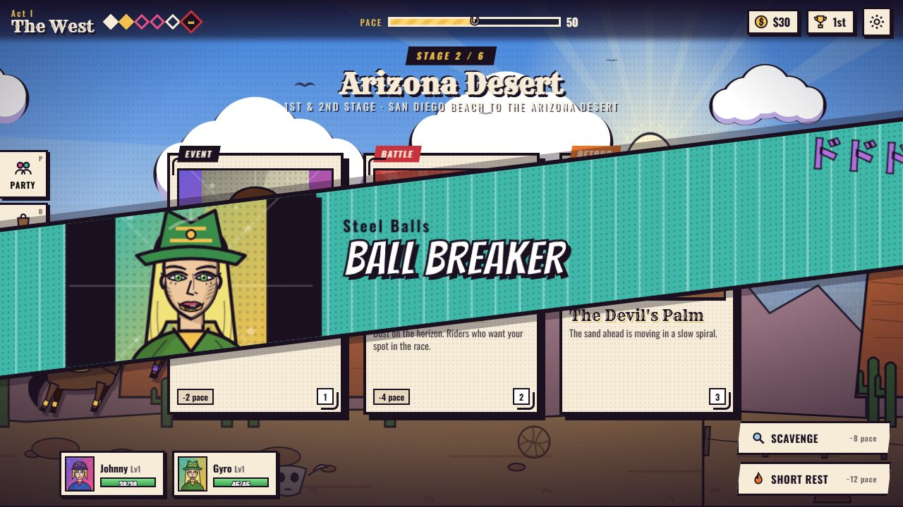
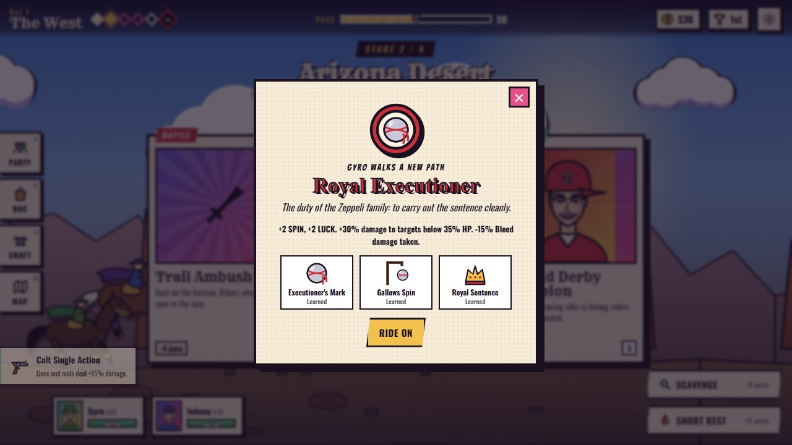
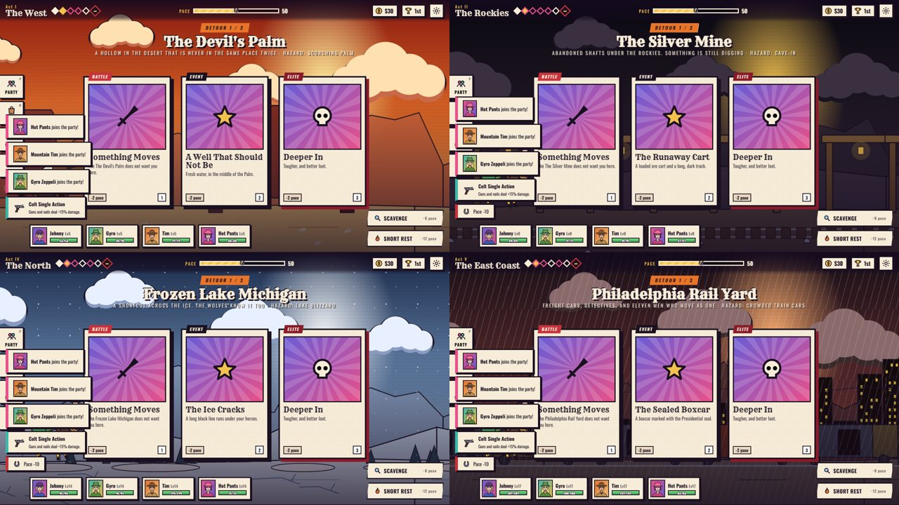
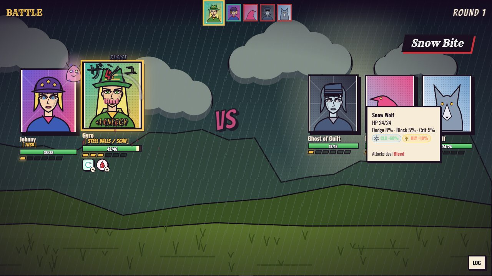
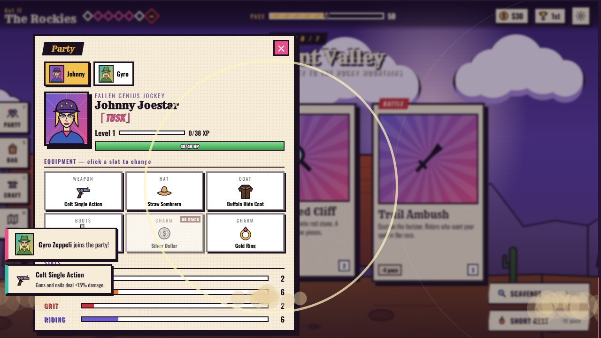

# Steel Ball Run: The Corpse Road

A fan-made browser roguelite based on *JoJo's Bizarre Adventure Part 7: Steel Ball Run*. Ride from San Diego to New York as Johnny, Gyro, Mountain Tim or Hot Pants. Recruit the others, walk a Path, detour through the Devil's Palm, and fight the President's Stand users in turn-based energy combat. The run structure is modelled on the Roblox game *An Average Campaign*.

All the art is drawn in code as SVG and canvas. All the music and sound effects are synthesized in WebAudio. There are no image or audio assets and no build step.


**[🎮 Play now](https://steel-ball-run-kohl.vercel.app)** · **[▶ Watch the demo video](docs/media/demo.webm)** · **[Showcase page](docs/index.html)**

## Play

Open `index.html` in any modern browser, or serve the folder:

```bash
python -m http.server 5178
```

Then open <http://localhost:5178>. Progress saves in your browser's local storage.

## Screenshots

| | |
|---|---|
|  **Encounter cards.** Every card type has its own drawn illustration, and each deal is announced by a slashing "ENCOUNTER!" banner. |  **Stand battles.** Stands appear when their abilities fire, and some hover beside their user for the whole fight. |
|  **Manga cut-ins.** Big moves slam a diagonal panel across the screen with the attacker and the move's name. |  **Boss intros.** Each Stand user explains their mechanic before the fight. |
|  **Lead riders and horses.** Pick your lead, a horse and a starting item. The horse gives resistances the way a race does in AAC. |  **Paths.** Each lead has three subclasses, learned from trainers on the road. |
|  **Detour areas.** Five optional regions, each with its own hazard, enemies, materials and boss. |  **Damage types.** Every hit has a type, and every enemy has its own resistances and weaknesses. |
|  **Six gear slots.** Weapon, hat, coat, boots and two charms. Charms of the same family don't stack. |  **Stage sprints.** Time your presses to the golden zone while rivals attack you and each other. Numbered nobodies fill out the pack, and the trail kills more of them every stage. Only Stands that help someone ride work in a race, and your horse has its own once-per-race trick, announced with a galloping cut-in and drawn on the track (speed streaks, a shield bubble, golden rhythm notes, dust clouds on the riders it stalls). The winner gets an announcer's splash and a manga page. |

## How a run plays

1. **Choose a lead rider, a horse and a starting item.**
   - Johnny and Gyro are available from the start. Mountain Tim unlocks when you clear Act II, and Hot Pants when you clear Act III.
   - Johnny and Gyro join the story whoever you pick. The custom rider can turn them down at the well; after that their lines are left out, and story beats that only make sense with them are not offered.
   - Your lead never leaves the party. Story departures become wounds or changes of heart instead.
2. **Ride through six acts.** They follow the real race legs: the Arizona desert, the Rockies, the Midwest, the frozen north, Philadelphia and New York.
3. **Choose an encounter each stage.** Most encounters open on a drawn scene of what's happening, and each choice continues the strip with a panel showing what came of it. You get three cards: a fight, a shop, a story event with a d20 skill check, a trainer, an ally or a detour. You can also Scavenge or take a Short Rest instead.
   - Every event choice changes something: an ally joins, you gain gear, a fight breaks out, a stat changes, or a flag is set that comes back later.
   - Rob the boy in the ditch and his brother hunts you down two acts later.
4. **Walk a Path.** Each lead has three Paths, which play the role of AAC's subclasses. Trainers on the road teach them: pass their check or beat them in a duel.
   - A Path gives a passive bonus, resistances, and three abilities that unlock at levels 1, 3 and 5. Taking one closes off the other two.
   - Johnny: Jockey, Nail Gunner, Heir to the Golden Spin.
   - Gyro: Royal Executioner, Zeppeli Physician, Golden Rider.
   - Mountain Tim: Sheriff, Lonesome Rope, Rancher.
   - Hot Pants: Sister of the Vatican, Flesh Sprayer, Corpse Hunter.
5. **Take a detour.** Detours are optional side areas, like AAC's Mines and Sewer. Each has a hazard that affects every battle inside it, its own enemies and materials, story events and a boss. You then rejoin the race a little behind the pack.

   | Detour | Hazard | Boss |
   |---|---|---|
   | The Devil's Palm | Scorching heat | A boss whose immunity shifts to a new damage type every round |
   | The Silver Mine | Cave-ins | A dinosaurified fossil colossus |
   | Frozen Lake Michigan | Blizzard | The White Alpha and its pack |
   | Philadelphia Rail Yard | Crowded train cars | Tattoo You!'s eleven men acting as one |
   | The Pillar Tomb (Acts II–III) | No sunlight: the undead regenerate and resist Holy | Wamuu and Esidisi, two Pillar Men who fight as a pair |

   - Each detour has 2–3 story events (every choice leaves a mark in the Chronicle), its own regular enemies and an elite: a heat-haze racer, a dinosaurified shift boss, drowned racers, a Pinkerton, and a Black Knight.
   - Detours drop exclusive gear, crafted from their materials: the Pilgrim's Rosary, the Heat-Haze Veil, a Deep-Shaft Lamp Helmet, the White Album Suit, a Pinkerton Shield, Wamuu's Headdress and Esidisi's Heat Veins.
   - Some detours end differently. Something might be waiting at the heart of the Palm instead of its Echo if you paid your respects on the way in, or if you carry enough of the Saint. An empty suit skates on Lake Michigan once somebody breaks it out of the ice.

6. **Fight.** Every unit, ally or enemy, starts a battle with 1 Energy and gains 1 per turn.
   - Hits have one of nine damage types: Physical, Gunshot, Spin, Stand, Bleed, Cold, Sound, Holy and True.
   - Resistances add together and come from enemies, horses, gear, Paths and statuses. True damage ignores them. For example, Blackmore is immune to Cold, ghosts shrug off bullets, and Valentine is weak to Spin.
   - Some moves let you pick 1 to 4 targets. A badge on the button (×2, ×3, ×4) shows how many. Click the cards you want, then press Go or Enter, or press Max to take the most. Split moves share their damage: two targets take 62% each, three take 46%, four take 38%. Buffs, heals and debuffs with a badge give every pick the full effect.
   - Area attacks hit every target at the same moment.
   - Enemies use picks too. Gunmen and packs spread their fire, and elite healers cover two allies.
   - **Aggro.** Enemies choose single targets at random, weighted by aggro, as in AAC. Front-liners like Wekapipo and Mountain Tim draw more attention, and Lucy and Hot Pants draw less. GRIT raises aggro a little and RESOLVE lowers it. Heavy gear such as the Iron-Plated Vest raises it, and light gear such as Racing Silks lowers it. Big hits, heals and Stand moves raise it for a while, and taking hits lowers it. Evasive and **Lying Low** make you hard to notice. A badge on each party card shows your chance to be picked, and a red crosshair marks the most likely target. Hover the badge for the breakdown. At higher Threat, enemies also go after the wounded.
   - **Taunt.** A taunting ally draws 85% of single-target attacks, which is what Tim's **Draw!**, Wekapipo's **Royal Challenge** and the custom rider's **Showboat** are for. Some elites and bosses taunt too (Stroheim, the Presidential Guard, Wekapipo, Honey-Mouth Ike). While one is taunting, your single-target moves can only pick the taunter.
   - **Summons.** Some moves call help onto your side of the field. Summons act at the end of each round, can be hit, and vanish when their summoner falls or their rounds run out. They never count as party members. You get Tim's Longhorn Steers and rope Scarecrow, Gyro's Spinning Sentry, Johnny's wandering Nail Hole, Hot Pants' Flesh Double (a taunting decoy), two of Diego's raptors, Pocoloco's Hey Ya! cheerleader, and Killer Queen's Sheer Heart Attack. The Harvest Jar and Stray Cat in a Pot items summon too. Up to four can be on the field at once.
7. **Gear up.** Enemies drop materials and Stand Remnants for the crafting bench.
   - Each rider wears a weapon, a hat, a coat, boots and two charms.
   - Charms belong to families, and two charms from the same family don't stack.
8. **Beat the act boss, then race to the finish.** Each boss's mechanic comes from their Stand:
   - Ringo's Mandom rewinds six seconds, and he shoots first afterwards.
   - Blackmore hides in frozen rain that only Spin attacks can pierce.
   - Valentine's copies take his hits.
   - Diego's THE WORLD stops time more often as he gets desperate.
   - **Bosses fight like bosses.** They usually move first, and against three or more riders they also get an **Overwhelming Presence** move at the end of the round. Their HP and damage grow with the act and with every rider you bring.
   - **Telegraphs.** A boss announces its next big move: a badge on its card, a crosshair on the rider it's aiming at, and a strip under the top bar ("Ringo is aiming Quickdraw at Johnny"). The telegraphed move hits much harder, but **Brace** (Guard now lasts until your next turn) cuts it to about a third, a **Taunt** pulls a single-target one onto the taunter, and a **stun interrupts it**. Area telegraphs also drain 1 Energy from every rider who didn't brace.
   - **No cheese.** After a stun or time stop a boss is **Steeled** and shrugs off the next ones for two turns. A single hit can take at most 15% of a boss's HP (10% for Strange Auras), so burst can't delete one. At half HP a boss catches a **Second Wind** (cleanse, a small shield, +15% damage), and a fight that drags past round 9 (13 for Strange Auras) makes it **furious**. Whatever it summoned scatters when it falls.
   - Elite fights hit harder too, and the strongest elite telegraphs its big move.
9. **Build up across runs.** Race Points buy permanent Techniques, and unlock horses (about 70–110 RP) and starting items (45–90 RP) from the Stable or the setup screen. Achievements unlock lead riders and Techniques, and still unlock their horse or item for free.
   - Some Techniques change the rules instead of adding numbers, each with a catch: **Requiem** (+35% damage, fight at 70% HP), **Golden Rectangle Discipline** (no natural Energy; free attacks give +2), **D'Arby's Wager** (roll checks twice, but failures cost HP), **Lone Wolf** (a lone lead gets +60% damage, Energy and dodge), **Wanted Poster** (+2 Threat from the start, +40% money and XP), **Express Rider** (one fewer card, more pace and XP), **Stone Mask Pact** (half healing, but hits heal you) and **THE WORLD's Opening** (enemies lose their first turn, you start with less Energy).

## Legacy skill trees

Each lead rider (Johnny, Gyro, Mountain Tim and Hot Pants) has a permanent skill tree bought with Race Points, like the class trees in *An Average Campaign*. Open it from the Saloon's **Legacy** tab, or from the registration screen for the lead you've picked.

- **Three branches per rider, seven nodes each.** Johnny has Tusk, Jockey and Spin. Gyro has Steel Ball, Zeppeli Medicine and Golden Rectangle. Mountain Tim has Oh! Lonesome Me, Sheriff and Rancher. Hot Pants has Cream Starter, Vatican and Corpse Hunter.
- **Nodes branch.** Each branch splits into two arms, and the node where they meet needs only one of them. Costs rise from 10 to 70 RP, so a full tree costs 663 RP, which is several runs' worth.
- **Minor nodes** give stats, damage by type, crit, dodge, block, starting Energy, Regen, resistances, battle HP, skill-check bonuses, or an ability early (Nail Bullet, Wormhole, Scan, Golden Spin, Rope Corral, Flesh Disguise).
- **Capstones change how the rider fights.** Examples: Nail Storm (a volley at every enemy, and Johnny's basic attacks always leave a Nail Hole), Slow Dancer's Rhythm (a dodge gives Energy and a counter-nail), Twin Balls (Steel Ball throws a second ball), Zeppeli Surgery, Ball Breaker from the first stage, High Noon (Tim always draws first and his first shot always crits), Cattle Drive, Flesh Armour (overhealing becomes Shield), Vatican Rite (Holy revolver rounds) and Relic Sense.
- **Bonuses apply only to your lead.** A rider's Legacy powers them when they start the run; the same rider joining as an ally rides without it.
- **Respec** refunds everything for a 10% fee (at least 10 RP).
- **Legacy ranks.** Once a tree is complete, each of five ranks adds +3% damage and +4 battle HP (60–180 RP each).

## Risk, choices and variety

- **Danger stars.** Every encounter card shows 1–5 stars. Higher stars mean bigger fights and harder checks, and much better pay: more money, XP and materials, and a chance of rare gear. What kind of card it is (fight, shop, trainer, event…) stays hidden until you pick it.
- **Optional story.** Story beats are offered next to two other cards. Skip one and the world moves on without you: villains ambush you later, allies never join, or people die off-screen. Most beats have 2–4 choices, and each choice can change the fight that follows.
- **Different every run.** Each act has four lineups with different bosses and beat orders, and each run starts with an omen that twists the race. There are 18 endings, chosen by faction standing, who lived and who rode with you, the story choices you made, and the Corpse Parts you still carry.
- **Manga-panel scenes.** Bosses, elites, trainers and side encounters talk before, during and after their fights on drawn comic pages, with speech bubbles, speed lines and Stands.
- **Side encounters.** Stand users from earlier parts (Emperor, Hanged Man, Yellow Temperance, Death 13, Bad Company, Sex Pistols, Aerosmith, Kraft Work, Moody Blues…), vampire nests, zombie horses, a Hamon monk and a Pillar Man.
- **The Saint's Corpse matters to everyone.** Every part you carry gives your lead a battle ability. Holding 3, 5 or 7 parts blesses the party and adds a race power, but the President hunts you harder. Parts can also be offered to the Vatican, sold for a pardon, buried, or fused.

## Strange Auras (secret superbosses)

Like the hidden "Strange Aura" bosses of *An Average Campaign*, five superbosses from other parts of JoJo are hidden in the race. They are optional and very hard.

- **How you know.** A Strange Aura shows up as a face-up **??? STRANGE AURA** card with seven stars (★★★★★★★). Picking it asks you first, because you can't run from the fight and losing it ends the run. You can back away.
- **They scale.** Each one matches the act you meet it in, at roughly two to three times that act's boss. Each has several phases: extra lives, time that speeds up, time stops, rewinds, or a horde.
- **Rewards.** A unique Soul (a recipe key for their legendary gear), the first legendary piece for free, and an achievement that unlocks a new Technique for every later run: *Ultimate Adaptation*, *Time Acceleration*, *Stopped-Time Knives*, *A Quiet Life* and *Dinosaur Kinetic Vision*.
- **Where to look (hints).**
  - Three of them wait below a detour's boss. A detour event opens the way down. Look for a door that wants something pressed into it, a skull with no eyes, and a passenger who notices your hands. A hard skill check works too, and so does carrying the right thing.
  - One of them only walks the late race while you carry most of the Saint's bones.
  - One of them only comes through D4C's doors when the President hunts you as hard as he can.
- **Debugging.** `SBR.debug.superboss('sb_kars')` starts a fight straight away (the keys are `sb_kars`, `sb_pucci`, `sb_dio`, `sb_kira` and `sb_trex`). `SBR.debug.secret(key)` deals the secret card, or opens a detour's hidden deep stage.

## Your own rider

The fifth lead is one you make yourself. Pick them on the registration screen, then press **Edit your rider** to choose their name, title, skin, hair, eyes, hat, outfit, a detail such as a scar or a monocle, and backdrop.

They start with nothing but an old six-shooter and a punch, and can earn **one** power on the road. Each power is borrowed from another part of JoJo:

- **Hamon.** An old man balanced on a pole teaches the Ripple. It deals Holy damage, and double damage to the undead.
- **Vampire.** Put on a Stone Mask. You get lifesteal and regeneration, but you are weak to Holy and Spin damage and you burn in scorching sun.
- **German Cyborg.** Only badly hurt riders meet the field surgeons. You get armour, a chest machine gun and a UV lamp.
- **A Stand**, from the Stand Arrow: a single encounter in Acts I–II. Cut yourself (a Resolve check: pass and three Stand tarot cards are dealt, and you choose one; fail and the Arrow either chooses for you or rejects you), take it from its keeper in a fight, or pay and let fate decide. The 12 Stands are Star Platinum, Magician's Red, Hierophant Green, Silver Chariot, Crazy Diamond, Killer Queen, The Hand, Gold Experience, Sticky Fingers, King Crimson, Stone Free and Whitesnake.
- **The Red Stone of Aja.** It evolves a Hamon user into the Aja Amplifier, or a vampire into the Ultimate Life Form.

## Materials, gear and money

The crafting system follows *An Average Campaign*: a few materials that are reused everywhere.

- **16 materials.**
  - Nine generic, each borrowed from another part of JoJo: Cyborg Scrap (Stroheim's German science), SPW Saddle Leather (Speedwagon Foundation stock), Satiporoja Silk (the beetle-hair silk of Lisa Lisa's scarf), German Army Powder, Trussardi Herbs (Tonio's garden), Pet Shop Feathers, Vampire Fang, Chariot Silver and Aztec Gold (from the ruins of the Stone Masks).
  - Five special: Steel Ball Shard, Golden Sap, Menger Dust, Frozen Water and Fossil Shard.
  - Two found only on detours: Devil's Palm Sand and Eleven Men Ink.
  - Every material is used in at least four recipes. Its tooltip lists where it drops and what it makes.
- **Crossover gear and supplies.** Most everyday gear and consumables are real objects from Parts 1–6 rather than generic Western kit:
  - Supplies: the SPW Canteen, Kakyoin's Cherries, Iggy's Coffee Gum, Tonio's Mineral Water, Stroheim's Grenade, a Heaven's Door Page (revive), Zeppeli's Hamon Wine and an Aqua Necklace Bottle (a gamble).
  - Gear: Mista's Revolver, Jotaro's Cap and Gakuran, Speedwagon's Bowler Hat, Zeppeli's Top Hat, Mista's Hat, Lisa Lisa's Scarf, the Stone Mask, DIO's Throwing Knife and the Anubis Sword, Bucciarati's Zipper Suit, Pucci's Vestments, Stroheim's Cyborg Legs and Fist, White Album Skates, Ghiaccio's Glasses, Hol Horse's Spurs, D'Arby's Poker Chip, Polnareff's Earrings, Kira's Skull Tie, the Echoes Egg, Giorno's Ladybug Brooch, Rohan's G-Pen, Caesar's Bandana, Joseph's Polaroid Camera, the Hamon Breathing Mask, Boingo's Prophecy Comic, Speedwagon's Oil Deed, the Trattoria Trussardi Menu, DIO's Diary, Mista's Bullet Pouch and Sex Pistols Rounds.
  - Things the race's own story hands you (the Winchester, Pocoloco's horseshoe, Wekapipo's sabre, Hot Pants' sandwiches, Gyro's tar coffee, Sandman's emerald) stay as they are.
- **Souls.** Stand Remnants are recipe keys. Owning one unlocks that boss's gear for the rest of the run, and crafting never uses it up.
- **Upgrades.** Some recipes take a piece you already own and make a better one. For example, a Colt Navy becomes a Winchester '73, DIO's Throwing Knife becomes the Anubis Sword, and Riding Boots become Cavalry Boots.
- **Reinforce and salvage.**
  - At the bench, any piece can be raised to +1 and then +2. It costs materials that match its slot, plus money.
  - A blacksmith in town does the same for money only.
  - Salvaging gear gives back half its materials.
- **Tracking.** Pin a recipe and its missing materials show in the HUD. The Craft tab shows how many recipes you can make right now, and the bench has a "Craftable now" filter.
- **Money has uses.**
  - Money is scarce. Fights, events and stage prizes pay about half what they used to, and shops buy gear back at 25% and supplies at 20%.
  - Town services: a doctor, a farrier, guides, the telegraph office, the church, newspaper adverts and the blacksmith.
  - Paid training.
  - Checkpoints between acts, about half the time (more often when you're Hunted). Each is one of five scenes: a small toll, a free relief station, a search by the President's men (dangerous if you carry Corpse parts), a rival's protest, or the press tent. Only some cost money.
  - Bribing a scout to redraw the stage's encounters.

## More of Steel Ball Run

About 26 encounters are taken from the manga's side stories, in race order. They include:

- Mr. Steel's press tent, and Sandman trying to pay with an emerald.
- Mountain Tim's dented horseshoe, and the Boomboom family framing you in disguise.
- Gaucho and Ringo's cabin, the Green Tomb pigeon, Dot Han caught by In a Silent Way, and Diego thrown in the storm.
- The Milwaukee casino and its eleven men, the log road under the ice, the wolf carrying the Corpse's legs, Nicholas's boots and Kuma-chan, and the First Lady's hotel in Chicago.
- Magent in the Delaware River, Lucy at Independence Hall, the steamboat *Blue Hawaii*, and Trinity Church.

Other racers join the leaderboard: Sloop John B, Georgy Porgy, Nellyville, Gaucho, Mack the Knife, Dixie Chicken, Baba Yaga and Norisuke Higashikata. Tubular Bells now happens in Chicago, in Act IV.

## Your choices matter

Every choice feeds a hidden world state, like a tabletop campaign. Nothing tells you what a choice will do.

- **Six factions remember you.** The President, the Vatican, the racers, Sandman's people, the House of Naples and the law.
- **Recurring people remember you too.** The scout, the Blackwood brothers, the farrier, Mrs. Robinson, Oyecomova, Dot Han and others.
- **Consequences come back later as their own encounters.** Spare Mrs. Robinson and he returns with a warning about Blackmore's rain. Burn an agents' camp and you meet the farmer whose harvest burned.
- **Story beats branch.**
  - Warn Mountain Tim and he survives Kansas City.
  - Earn Hot Pants' trust and she refuses to steal the Corpse.
  - Befriend the scout and you can talk Sandman out of the fight.
  - Take Valentine's napkin and become the President's Knight.
  - Keep Naples on your side and Gyro can survive the Love Train.
- **Six endings.** They are chosen by what you did, not only by where you finish.
- **The Chronicle** (`J`, or the tab on the left) records your deeds. When a consequence finally happens, it writes what the deed caused in red ink. The ending shows the full list.

## Your allies have opinions

Every ally who isn't your lead has likes and dislikes taken from the manga. Gyro likes Naples, cheese, the Spin and doctoring, and hates cruelty. Johnny wants the Corpse and to win, and hates resting. Mountain Tim likes the law and protecting Lucy. Hot Pants likes the Vatican and hates robbery and the President's deals. Pocoloco likes luck and gambling. Wekapipo likes honour and shielding the weak. Lucy dislikes violence. Diego likes money and winning, and hates charity.

- **You can see it coming.** Small portrait badges on each encounter card show who in the party would like (♥) or dislike (✗) that road. The Party screen (`P`) shows each ally's bond bar and what they like and dislike.
- **Cards.** Picking a card an ally likes raises their bond. Picking one they dislike, or passing up one they wanted, lowers it. Scavenge and Short Rest count too: Pocoloco and Diego like scavenging, Lucy likes resting, and Johnny and Diego hate it.
- **Choices.** An event or story answer is read from its label, the deed it records and the faction standing it moves. Robbing the wounded boy makes Gyro, Tim and Wekapipo disapprove.
- **Bond runs from 0 to 100** and starts at 55. A toast with the ally's portrait and a line in their voice shows each change.
  - **Devoted (80+):** +6% damage and +3% crit.
  - **Wary (30 or less):** −1 starting Energy. The ally also asks to talk a stage or two later. You can hear them out, make it up to them with a $40 gift, or tell them to ride or leave (a RESOLVE check).
  - **10 or less:** they leave the party at the next safe point, which is before the next stage's cards. A manga page shows them saying why. A story event can still bring them back later, and they return at 40.
- **Johnny and Gyro are bound to the story.** Their bond never drops below 15, so they can turn Wary but never leave. In the final act nobody leaves. Reserve riders keep their bond as it is, and the lead rider has no bond.
- **Party full.** When a fifth rider wants to join, a picker opens once the current panel closes. You choose who moves to the reserve, or you keep the newcomer in the reserve. The lead, Johnny and Gyro can't be benched. When Johnny or Gyro is the one joining, someone has to make room.

## Debugging

Press the backtick key (`` ` ``) or open `index.html?debug` for the debug panel. It jumps to any act, stage, side event, story scene, fight, boss lineup, detour, sprint or ending, with the lead, level, threat and faction standing you choose. The same jumps are scriptable from the console as `SBR.debug.*`.

## Stand animations

Every Stand move has its own animation, based on how it looks in the manga and anime. Examples: Star Platinum's afterimage fists and Star Finger; a grey frozen world with hanging fists for The World; Killer Queen's thumb click before a delayed blast; The Hand's void gouge; King Crimson's red void of erased frames; Crossfire Hurricane's ankh flames; Hierophant's 20 m string web; Tusk's spinning nails and holes; D4C's flag; Catch the Rainbow's frozen raindrops; In a Silent Way's solid lettering; Chocolate Disco's grid. Higher power tiers and upgrade levels mean more hits, bigger titles and longer beats. Every animation is divided by the game speed, and Reduced Motion drops the shakes, card jolts and flicker.

- `js/standfx.js` holds the moves. `SBR.standfx.MOVES` is keyed by ability id. `SBR.standfx.NAMED` is keyed by the enemy move's name. `SBR.standfx.STYLE` holds each close-range Stand's default barrage.
- `SBR.fx.play` and `SBR.strike.rush` check these tables first, so `battle-ui.js` needs no changes to add a move.
- Try any move from the console: `SBR.standfx.play('time_erase', {x:300,y:300}, [{x:1000,y:300}], {tier:3, via:'rush', key:'king_crimson'})`.

**Sprite sheets.** Everything is drawn in code. You can still drop in a PNG sprite sheet for a Stand's body, and it replaces the SVG wherever that Stand appears in a move:

```js
SBR.standfx.sprites.star_platinum = { src: 'sprites/star_platinum.png', frames: 8, cols: 4, fps: 14, loop: true };
SBR.standfx.sprites['star_platinum.rush'] = { /* optional: used for close-range barrages */ };
await SBR.standfx.loadSprites('sprites/manifest.json');   // or a JSON manifest { key: {src, frames, cols, fps, loop} }
```

Frames are read left to right, then top to bottom. Sheets from a generator such as sprite-gen fit this format once exported as a grid plus a frame count. Without a sheet, the procedural drawing is used.

## Music

Every act, every detour, normal, elite and boss battles, the sprint and the saloon each have their own synthesized theme. Diego and Valentine get their own boss themes. Music volume is in Settings.

The game can't ship music from other games or anime. To use your own tracks locally:

1. Create a `music/` folder next to `index.html`. It is gitignored.
2. Put your audio files in it.
3. Add a `manifest.json` that maps theme keys to files, for example `{"act1": "desert.mp3", "boss": "boss.ogg"}`.

The theme keys are `title`, `act1` to `act6`, `devilspalm`, `silvermine`, `lakeice`, `railyard`, `battle`, `elite`, `boss`, `boss_diego`, `boss_valentine`, `sprint` and `shop`. Your own tracks only load when the game is served from localhost.

## Controls

| Key | Action |
|---|---|
| `1`–`7` | Use an ability, or pick an encounter card |
| `Q` / `E` | Brace / use an item |
| Click, then `Enter` | Pick several targets for a ×2–×4 move, then confirm (`Space` toggles the target highlighted with `Tab`) |
| `P` `B` `C` `M` `J` | Party, Bag, Crafting, Map, Chronicle (also the tabs on the left of the screen) |
| `` ` `` | Debug panel |
| `Space` | Advance dialogue / surge in the sprint |
| `Esc` | Settings (speed, sound and music volume, screen shake, reduced motion) |

## Code layout

| File | Contents |
|---|---|
| `js/core.js` | Namespace, utilities, save data, sound-effect synth, tooltips |
| `js/audio.js` | Music sequencer and themes, ambience, extra sound effects, your-own-tracks loader |
| `js/art.js` | Portraits, horses, parallax scenes, the US map |
| `js/icons.js` | Drawn icons for items, materials, gear, abilities, statuses and damage types |
| `js/stands.js` | Drawn Stand figures, their flashes and the Stands that hover beside their users |
| `js/jojo.js` | Encounter card illustrations, manga cut-ins, To Be Continued, the title logo |
| `js/data.js` | Stats, damage types, statuses, party abilities, characters, horses, items, techniques, achievements |
| `js/enemies.js` | Enemies, bosses, their Stand mechanics and resistances |
| `js/story.js` | Acts, rivals and dialogue scenes, including lines that change with your lead |
| `js/events.js` | Side encounters, their choices, and the follow-up events those choices trigger |
| `js/paths.js` | Paths (subclasses), their abilities, trainers and emblems |
| `js/crafting.js` | Materials, Stand Remnants, equipment and slots, recipes, drop tables |
| `js/variety.js` | Threat, generated fights, enemy traits, race conditions, act lineups |
| `js/sbr.js` | Racers, canon side-story encounters, manga items, Act IV Tubular Bells |
| `js/manga.js` | Story branches, skip consequences, act lineups, omens and endings |
| `js/sides.js` / `js/corpse.js` | Side Stand users, vampires and Hamon; the Saint’s Corpse for every lead |
| `js/evscene.js`, `js/evs_a.js`–`js/evs_c.js` | Drawn encounter scenes: an opening panel for about 160 encounters and a follow-on panel for each choice |
| `js/multi.js` | Moves that hit or buff several picked targets, and how they split damage |
| `js/summons.js` | Aggro sources, Taunt, the party summons with their drawings, and the moves and items that call them |
| `js/panels.js` | Manga-panel dialogue pages and before/mid/after fight talk |
| `js/custom.js` | The custom rider, the creator, and the Hamon, Vampire, Cyborg, Stand and Aja powers with their encounters |
| `js/economy.js` | The 16 materials, Souls, upgrades, reinforce, salvage, selling, trinkets, services, fees |
| `js/campaign.js` | World state, factions, consequences, follow-up encounters, story branches, endings, the Chronicle |
| `js/trees.js` | Legacy skill trees: nodes, capstone abilities and triggers, the Saloon tab |
| `js/affinity.js`, `css/affinity.css` | Ally likes and dislikes, bond and its tiers, card badges, departures and the talk events; the party-full picker |
| `js/debug.js` | Debug panel and `SBR.debug` jump API |
| `js/areas.js` | Detour areas, hazards, their enemies, bosses, events and gear |
| `js/detours2.js` | More detour events, enemies, elites, exclusive gear and alternate bosses; the Pillar Tomb detour |
| `js/superbosses.js` | The Strange Aura superbosses: their mechanics, secret cards, Souls, legendary gear and Techniques |
| `js/combat.js` | Combat engine: pure state plus an event log |
| `js/bosstuning.js`, `css/bossintent.css` | The boss director: boss/elite scaling by act and party size, initiative, Overwhelming Presence, telegraphed moves and their counters, Steeled, hit caps, Second Wind and Fury. Tuning lives in `SBR.bossTuning.CFG` |
| `js/fx.js` | Canvas VFX: projectiles, slashes, spirals, damage-over-time effects |
| `js/standfx.js`, `css/standfx.css` | Per-move Stand choreography (time stop, ORA barrages, zippers, erased space, ankh flames...), routed by ability id or enemy move name |
| `js/battle-ui.js` | Replays combat events as animations and handles input |
| `js/sprint.js` | The stage-finish race |
| `js/ui.js` / `js/main.js` | Screens, drawers and dialogue; game flow and the event API |

## Credits

This is a non-commercial fan project. Characters, Stands and story beats belong to Hirohiko Araki's *Steel Ball Run*. The structure is inspired by *An Average Campaign*. The dialogue, art, music, code and game design are original.
