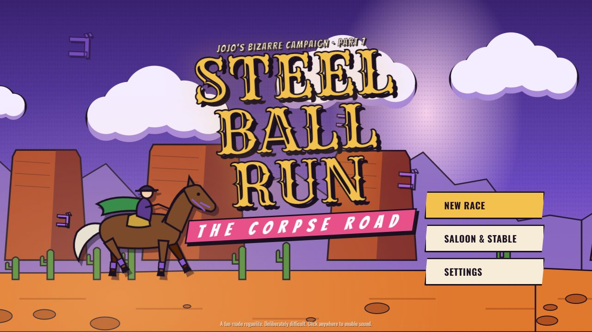
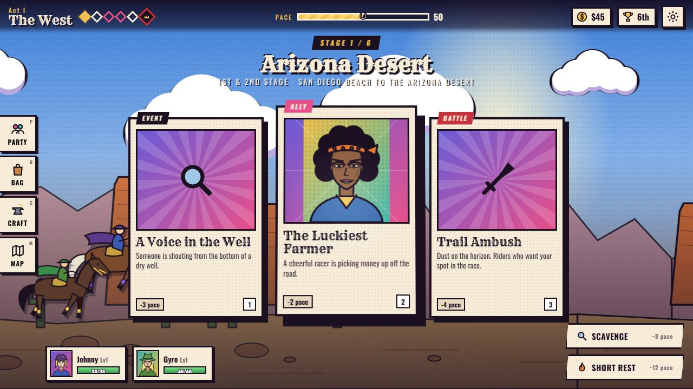
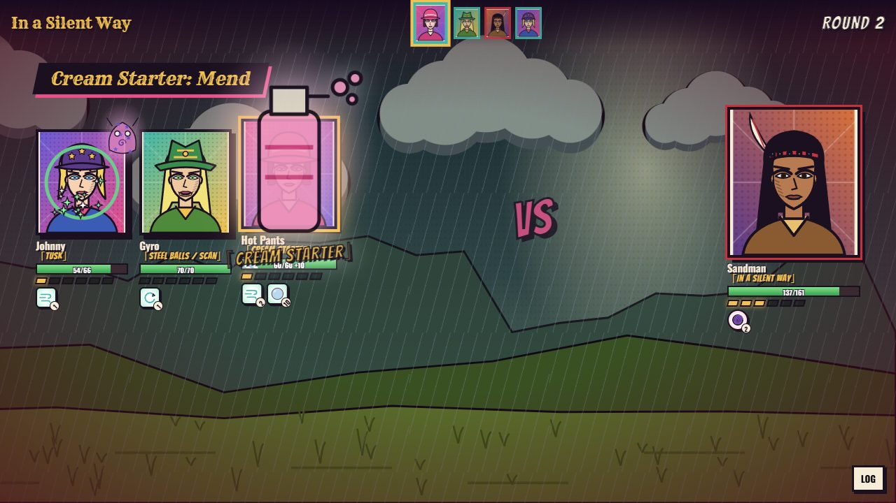
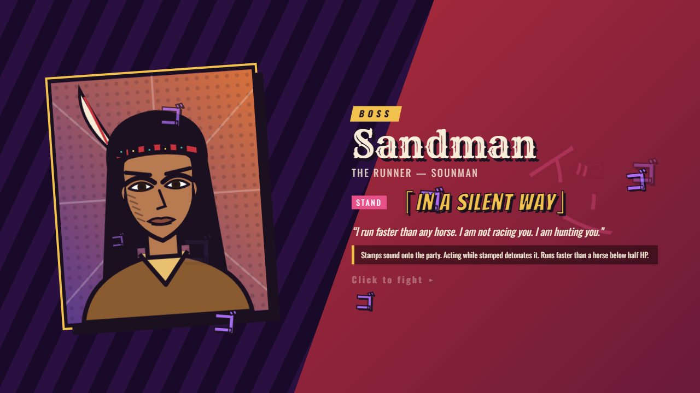
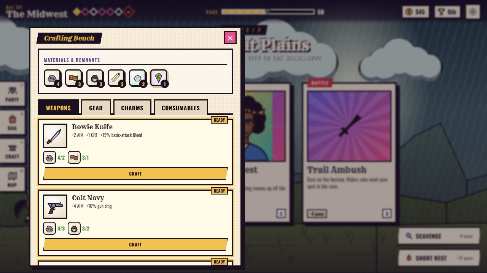
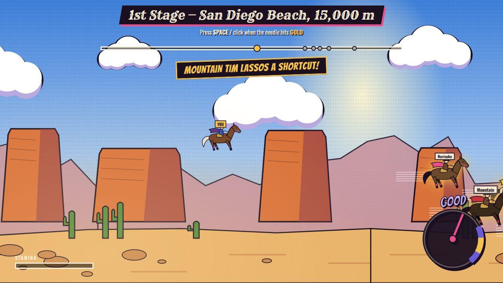
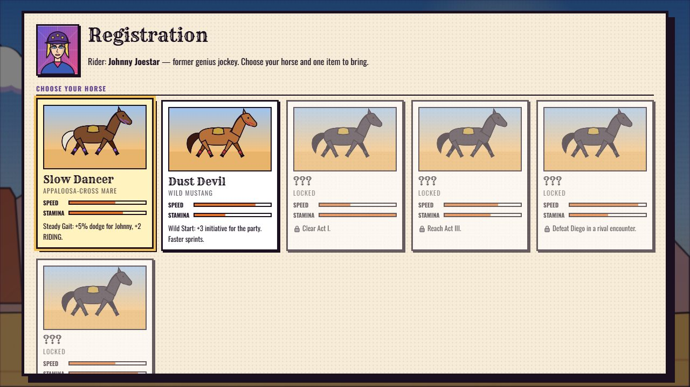

# Steel Ball Run: The Corpse Road

A fan-made browser roguelite based on *JoJo's Bizarre Adventure Part 7: Steel Ball Run*. You ride as Johnny Joestar from San Diego to New York, recruit Gyro and the others, and fight the President's Stand users with turn-based energy combat. The run structure is modelled on the Roblox game *An Average Campaign*.

Everything is drawn in code as SVG and canvas, and every sound is synthesized. There are no image or audio assets and no build step.



**[▶ Watch the demo video](docs/media/demo.webm)** · **[Showcase page](docs/index.html)**

## Play

Open `index.html` in any modern browser. You can also serve the folder:

```bash
python -m http.server 5178
```

Then open <http://localhost:5178>. Progress saves in your browser's local storage.

## Screenshots

| | |
|---|---|
|  **Encounter cards.** An "ENCOUNTER!" banner slashes in, then three cards fly onto the table. |  **Stand battles.** Stands appear when their abilities fire, and some of them hover beside their user all fight. |
|  **Boss intros.** Each Stand user explains their mechanic before the fight. |  **Crafting.** Enemy drops and Stand Remnants become weapons, gear and charms. |
|  **Stage sprints.** Time your presses to the golden zone while rivals use their Stands against you. |  **Horses instead of classes.** Six horses and seven starting items to unlock. |

## How a run plays

1. **Pick a horse and a starting item.** Horses play the role of AAC's races and classes. Each has speed, stamina and a perk.
2. **Ride through six acts.** They follow the real race legs: the Arizona desert, the Rockies, the Midwest, the frozen north, Philadelphia and New York.
3. **Choose an encounter each stage.** You get three cards: a fight, a shop, a story event with a d20 skill check, a trainer or an ally. Or you can Scavenge or take a Short Rest instead. Every event choice changes something: an ally joins, you gain gear, a fight breaks out, a stat changes, or a flag is set that comes back later. Rob the boy in the ditch and his brother hunts you down two acts later. Help the scout at the hot spring and his warning prepares you for Sandman.
4. **Fight.** Every unit, ally or enemy, starts a battle with 1 Energy and gains 1 per turn. Abilities spend Energy, and effects like Second Wind, Golden Heart, Rider's Calm, Fear and Hooked change how much you gain.
5. **Beat the act boss, then race to the finish.** Each boss's mechanic comes from their Stand:
   - Ringo's Mandom rewinds six seconds, and he shoots first afterwards.
   - Blackmore hides in frozen rain that only Spin attacks can pierce.
   - Sandman plants sound stamps and speaking stones.
   - Valentine's copies take his hits (DOJYAAAN~).
   - Love Train redirects all misfortune onto you.
   - Diego's THE WORLD stops time more often as he gets desperate.
6. **Build up across runs.** Race Points buy permanent Techniques, and achievements unlock horses, starting items and Techniques.

Johnny's Tusk evolves from ACT1 to ACT4 as the story advances. Allies join and leave with the plot: Mountain Tim dies, Hot Pants steals the Corpse Parts, and Gyro falls against Love Train.

## Controls

| Key | Action |
|---|---|
| `1`–`7` | Use an ability, or pick an encounter card |
| `Q` / `E` | Brace / use an item |
| `P` `B` `C` `M` | Party, Bag, Crafting, Map (also the tabs on the left of the screen) |
| `Space` | Advance dialogue / surge in the sprint |
| `Esc` | Settings (speed, volume, screen shake, reduced motion) |

## Code layout

| File | Contents |
|---|---|
| `js/core.js` | Namespace, utilities, save data, synthesized audio, tooltips |
| `js/art.js` | Portraits, horses, parallax scenes, the US map |
| `js/icons.js` | Drawn icons for items, materials, gear, abilities and status effects |
| `js/stands.js` | Drawn Stand figures, their flashes and the Stands that hover beside their users |
| `js/data.js` | Stats, status effects, party abilities, characters, horses, items, techniques, achievements |
| `js/enemies.js` | Enemies and bosses with their Stand mechanics |
| `js/story.js` | Acts, rivals and dialogue scenes |
| `js/events.js` | Side encounters, their choices, and the follow-up events those choices trigger |
| `js/crafting.js` | Materials, Stand Remnants, equipment, recipes, drop tables |
| `js/combat.js` | Combat engine: pure state plus an event log |
| `js/fx.js` | Canvas VFX: projectiles, slashes, spirals, damage-over-time effects |
| `js/battle-ui.js` | Replays combat events as animations and handles input |
| `js/sprint.js` | The stage-finish race |
| `js/ui.js` / `js/main.js` | Screens, drawers and dialogue; game flow and the event API |

## Credits

This is a non-commercial fan project. Characters, Stands and story beats belong to Hirohiko Araki's *Steel Ball Run*. The structure is inspired by *An Average Campaign*. The dialogue, art, code and game design are original.
